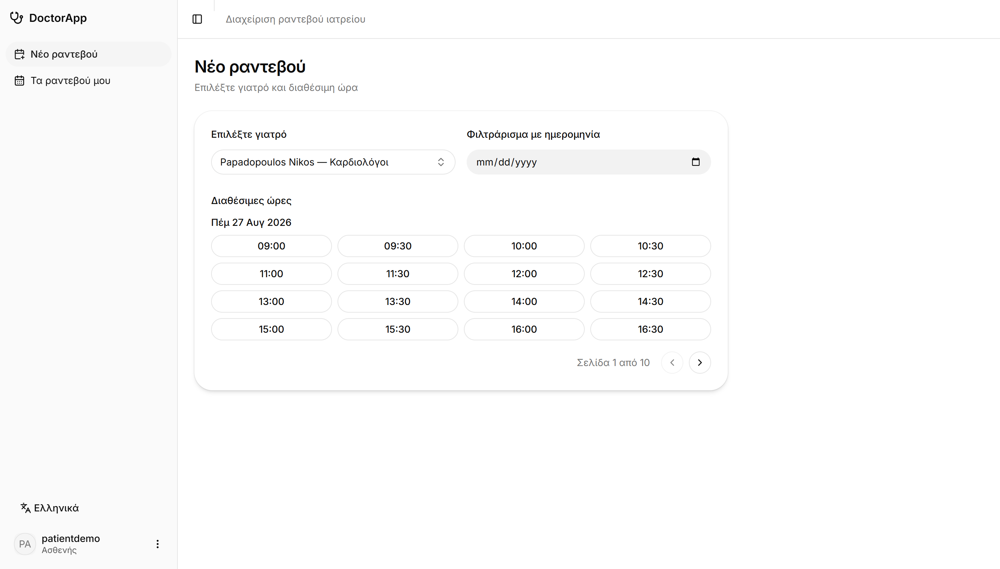
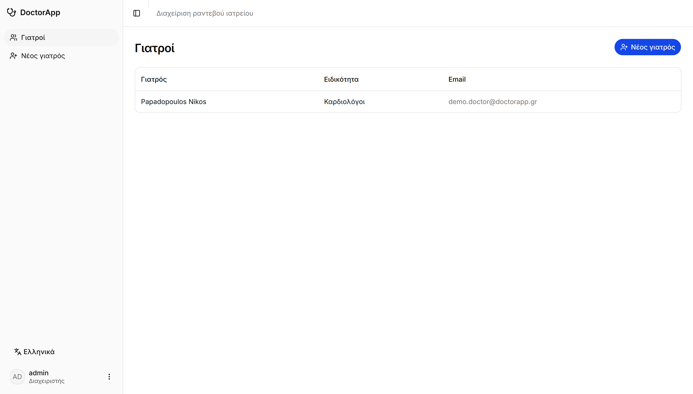
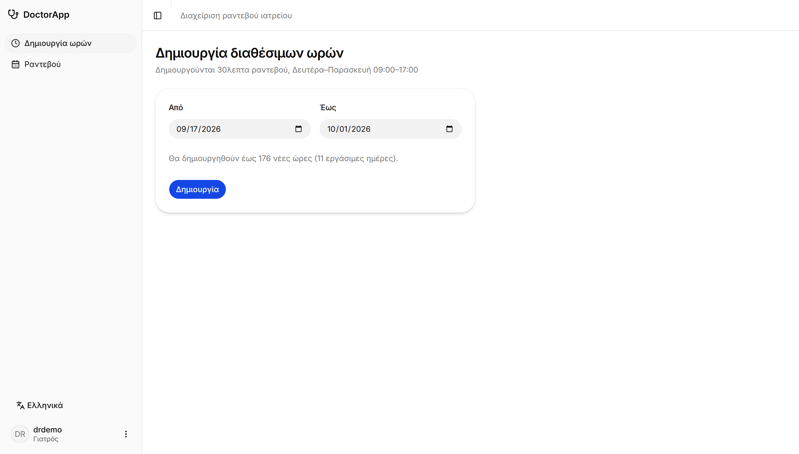
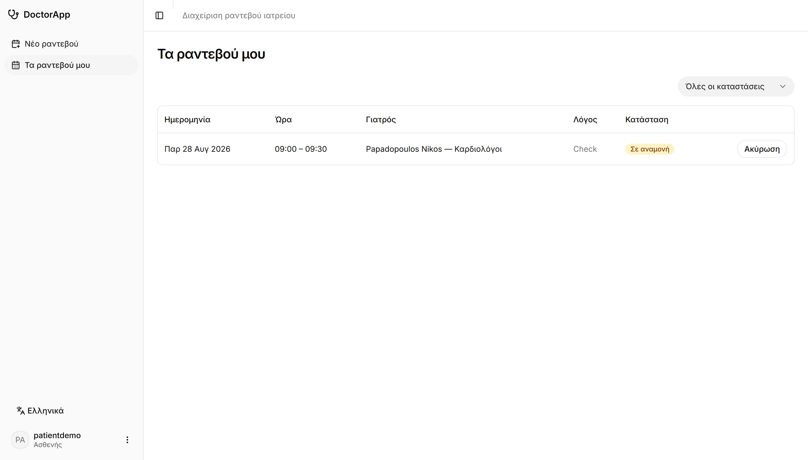
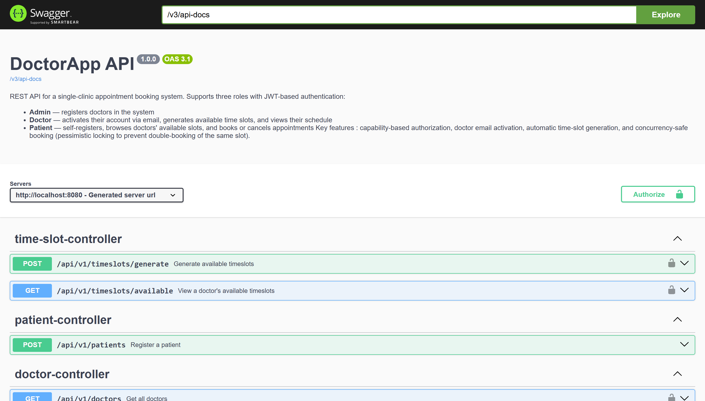

# Doctor App — Backend

REST API for a small clinic, built with Spring Boot: patients register and book appointments on doctors' time slots, doctors manage their schedule, and an admin manages the doctors.

Frontend (React SPA) lives in its own repository: [VasNera/doctor-app-frontend](https://github.com/VasNera/doctor-app-frontend).



## Features

- **Stateless JWT authentication** with role- and capability-based authorization (`ADMIN`, `DOCTOR`, `PATIENT`)
- **Patient self-registration** (account created together with the patient, password BCrypt-hashed)
- **Doctor onboarding flow**: admin registers the doctor → the doctor receives an activation email with a one-time token (48h expiry) → the doctor picks their own username & password. The admin never handles credentials.
- **Time-slot generation**: doctors generate their own availability (Mon–Fri, 09:00–17:00, 30-minute slots) for a date range — idempotent, weekends skipped, range capped
- **Appointment booking protected against double-booking** with pessimistic database locking
- **Appointment lifecycle**: PENDING → CANCELLED (cancelling frees the slot); ownership enforced
- **Pagination & filtering** on all listings (Spring Data `Pageable`, nested-property sorting)
- **Localized error messages** (EL/EN) via `Accept-Language`
- **OpenAPI / Swagger UI** documentation with JWT support
- Soft delete, audit columns (`created_at`, `updated_at`), UUID external identifiers

## Screenshots

Each role sees only what it is allowed to. All screens are available in Greek and English,
switchable at runtime.

**Admin — the doctors of the clinic.** Creating one here sends an activation email; the
admin never sets anyone's password.



**Doctor — generating availability.** Working hours are turned into 30-minute slots for a
date range, weekends skipped, with a live preview of how many slots will be created.



**Patient — own appointments.** Status is colour-coded and upcoming bookings can be
cancelled, which frees the slot for someone else.



**Swagger UI.** Every endpoint is documented and can be tried from the browser; the lock
icons mark the ones that require a Bearer token.



## Tech stack

| Concern | Choice |
|---|---|
| Language / runtime | Java 21 |
| Framework | Spring Boot 3.5 (Web, Data JPA, Security, Validation, Mail) |
| Database | MySQL 8, schema managed by **Flyway** (`ddl-auto=validate`) |
| Auth | Spring Security + JWT (jjwt), BCrypt (strength 12) |
| Email | JavaMailSender (Mailtrap sandbox in development) |
| API docs | springdoc-openapi (Swagger UI) |
| Tests | JUnit 5, Mockito, Spring MockMvc |
| Build | Gradle |

## API overview

All endpoints are prefixed with `/api/v1`.

| Method & path | Access | Purpose |
|---|---|---|
| `POST /auth/authenticate` | public | login → JWT |
| `POST /patients` | public | patient self-registration |
| `POST /doctors` | `CREATE_DOCTOR` (admin) | register doctor + send activation email |
| `POST /doctors/activate` | public (token) | doctor sets credentials, account activated |
| `GET /doctors` | `VIEW_DOCTORS` (admin, patient) | paginated doctors list |
| `POST /timeslots/generate` | `CREATE_TIMESLOT` (doctor) | generate own availability for a range |
| `GET /timeslots/available?doctorUuid=&date=` | authenticated | available slots of a doctor, paged |
| `POST /appointments` | `CREATE_APPOINTMENT` (patient) | book a slot |
| `GET /appointments/patient` | `VIEW_APPOINTMENTS` | own bookings (patient) |
| `GET /appointments/doctor` | `VIEW_APPOINTMENTS` | own schedule (doctor) |
| `PATCH /appointments/{uuid}/cancel` | `UPDATE_APPOINTMENT` (owner) | cancel, slot becomes available again |

Interactive documentation: **`http://localhost:8080/swagger-ui.html`** (authorize with a Bearer token to try secured endpoints).

## Build & Deploy

There are two ways to run the application: **with Docker Compose**, which brings up the
database and the API together with a single command, or **locally**, against your own
MySQL installation.

### Option A — Docker Compose (recommended)

Requires only **Docker Desktop** — no Java or MySQL installation needed.

```bash
git clone https://github.com/VasNera/doctor-app.git
cd doctor-app/doctor-app
cp .env.example .env
docker compose up --build
```

> Note the repeated folder name: the outer `doctor-app` is the repository, the inner one is
> the Gradle project — and that is where `docker-compose.yml` lives.

`.env.example` ships with working development values, so the copy above is enough to start
the application. Open `.env` only if you want to use your own database password or plug in
your own Mailtrap credentials.

`docker compose up` performs the whole build and deployment:

1. **Builds the application image** from [`Dockerfile`](doctor-app/Dockerfile) — a
   multi-stage build that compiles the project with Gradle on `eclipse-temurin:21-jdk`
   (`./gradlew bootJar`) and copies only the resulting jar into a slim
   `eclipse-temurin:21-jre` runtime image.
2. **Starts MySQL 8** with a named volume (`mysql-data`), so the database survives
   restarts, and waits for its healthcheck before starting the API.
3. **Runs the Flyway migrations** on first boot, creating the schema and seeding roles
   and capabilities.
4. **Seeds demo data** (development profile only) so the application is usable
   immediately — see [Demo accounts](#demo-accounts) below.

| Service | URL |
|---|---|
| REST API | `http://localhost:8080/api/v1` |
| Swagger UI | `http://localhost:8080/swagger-ui.html` |
| MySQL | `localhost:3307` (mapped from 3306 inside the container, to avoid clashing with a local MySQL) |

```bash
docker compose down       # stop, keep the database
docker compose down -v    # stop and delete the database volume
```

### Option B — Run locally

Requires **Java 21** and **MySQL 8**. The Gradle wrapper is included, so Gradle itself
does not need to be installed.

**1. Create the database:**

```sql
CREATE DATABASE doctorappdb;
CREATE USER 'doctorappuser'@'localhost' IDENTIFIED BY '<your password>';
GRANT ALL PRIVILEGES ON doctorappdb.* TO 'doctorappuser'@'localhost';
```

**2. Provide the configuration.** Create `doctor-app/src/main/resources/application-secret.properties`
(git-ignored, imported automatically):

```properties
MYSQL_PASSWORD=<the password from step 1>
JWT_SECRET_KEY=<Base64-encoded key, at least 256 bits>
MAILTRAP_USERNAME=
MAILTRAP_PASSWORD=
```

All four keys must be present, but the Mailtrap ones may be left empty — they are only
needed to send doctor activation emails, and the seeded demo doctor is already activated.

A ready-made development key is in `doctor-app/.env.example` and can be reused here. To
generate your own:

```bash
openssl rand -base64 32
```

On Windows without openssl, use PowerShell instead:

```powershell
[Convert]::ToBase64String((1..32 | ForEach-Object { Get-Random -Max 256 }))
```

**3. Run** — from the inner `doctor-app` folder, the one holding `build.gradle`:

```bash
cd doctor-app/doctor-app
./gradlew bootRun        # Windows: gradlew.bat bootRun
```

Flyway applies the migrations on startup and the application is available on
`http://localhost:8080`.

### Building a standalone artifact

```bash
cd doctor-app/doctor-app
./gradlew bootJar
java -jar build/libs/doctor-app-0.0.1-SNAPSHOT.jar
```

Configuration is fully externalised, so the jar needs no secret file — every setting can
be supplied as an environment variable, which is how the Docker image is configured and
how the application would be deployed to a host such as Railway or Render:

| Variable | Default | Purpose |
|---|---|---|
| `MYSQL_HOST` | `localhost` | database host |
| `MYSQL_PORT` | `3306` | database port |
| `MYSQL_DB` | `doctorappdb` | database name |
| `MYSQL_USER` | `doctorappuser` | database user |
| `MYSQL_PASSWORD` | — | database password (**required**) |
| `JWT_SECRET_KEY` | — | Base64 JWT signing key (**required**) |
| `MAILTRAP_USERNAME` / `MAILTRAP_PASSWORD` | — | SMTP credentials for activation emails |
| `ALLOWED_ORIGINS` | `http://localhost:5173,http://localhost:3000` | CORS whitelist — must include the deployed frontend's origin |
| `SPRING_DATASOURCE_URL` | — | overrides the whole JDBC URL, if needed |

`ALLOWED_ORIGINS` is easy to overlook when deploying: the API rejects any browser request
coming from an origin that is not on the list, so a frontend served from a new domain will
fail every call with a CORS error until its origin is added.

### Frontend

The React client lives in its own repository —
[VasNera/doctor-app-frontend](https://github.com/VasNera/doctor-app-frontend) — and is built separately.
It needs **Node.js 20.19+** and expects this backend to be running on port 8080:

```bash
git clone https://github.com/VasNera/doctor-app-frontend.git
cd doctor-app-frontend
npm install
npm run build      # type-checks and produces a static bundle in dist/
npm run dev        # development server on http://localhost:5173
```

`dist/` contains plain static files and can be served by any static host. The API base
URL is configured in `src/api/axios.ts`.

### Demo accounts

On startup (development profile) the application seeds an administrator, an activated
doctor with two weeks of available time slots, and a patient — so every role can be
explored without going through the email activation flow:

| Role | Username | Password |
|---|---|---|
| Admin | `admin` | `Ad12345!` |
| Doctor | `drdemo` | `Doc12345!` |
| Patient | `patientdemo` | `Pat12345!` |

The seeding is idempotent: accounts are created once, and the doctor's time slots are
topped up on every startup so there is always availability in the next two weeks.

### Tests

```bash
cd doctor-app/doctor-app
./gradlew test
```

The service and controller tests are pure unit tests and need nothing but the JDK.
`DoctorAppApplicationTests`, however, boots the whole Spring context, so it needs a
reachable database — run it after the setup of Option A or Option B above, or it will
fail with `Access denied for user 'doctorappuser'`.

## Architecture

Classic layered architecture — controllers stay thin, business rules live in services, persistence behind Spring Data repositories:

```
gr.aueb.cf.doctor_app
├── controller/        REST endpoints (validation wiring + delegation, OpenAPI annotations)
├── service/           IXxxService interfaces + implementations (@Transactional business rules)
├── repository/        Spring Data JPA repositories
├── model/             entities (extend AbstractEntity: id, uuid, audit, soft-delete) + enums
├── dto/               request/response records (insert / read-only per resource)
├── mapper/            DTO ↔ entity mapping
├── validator/         Spring Validators (uniqueness / cross-field → field-level errors)
├── authentication/    JwtService, CustomUserDetailService
├── security/          SecurityConfig, JwtAuthenticationFilter, custom 401/403 handlers
├── core/              GlobalExceptionHandler, typed exceptions, error DTOs
└── runner/            DataInitializer (idempotent admin seed)
```

**Error contract.** Every error returns a typed body: `{code, message}` (`ErrorResponseDTO`) or, for validation, `{..., errors: {field: message}}` (`ValidationErrorResponseDTO`). Messages are resolved from `messages.properties` per `Accept-Language`, and the field map is what the frontend binds 1:1 onto its forms.

## Design decisions

### Double-booking prevention (pessimistic locking)

Two patients booking the last free slot at the same moment is the core race condition of the domain. It is handled with **defense in depth**:

```java
@Lock(LockModeType.PESSIMISTIC_WRITE)
@Query("SELECT t FROM TimeSlot t WHERE t.id = :id")
Optional<TimeSlot> findByIdForUpdate(@Param("id") Long id);
```

1. The booking transaction locks the slot row (`SELECT … FOR UPDATE`) — a concurrent request **waits**.
2. Inside the lock, the status is checked: not `AVAILABLE` → `409 Conflict`.
3. A unique constraint on `appointments.timeslot_id` stands as the database's last line of defense.

Pessimistic (rather than optimistic `@Version`) locking was chosen deliberately: the conflict is the exact scenario being guarded, the transaction is very short, and the loser gets a clean 409 instead of a retry loop.

### Doctor activation via one-time token

Doctor accounts are created **without** a user: the admin enters professional details only, and the system emails a random UUID token (unique, 48h expiry). The doctor sets their own credentials on activation, after which the token is cleared. A doctor without a linked user simply cannot log in — no extra "active" flag needed. (The medical licence number was rejected as the activation secret: it is public information and would allow account hijacking.)

### Capabilities, not just roles

Authorization checks use fine-grained capabilities (`CREATE_DOCTOR`, `CREATE_TIMESLOT`, `CREATE_APPOINTMENT`, …) assigned to roles in the database and enforced with `@PreAuthorize("hasAuthority(...)")` at the service layer. Adding a permission is a data change, not a code change.

### Flyway owns the schema

`ddl-auto=validate`: Hibernate never touches the schema, it only verifies that entities match it. Applied migrations are immutable — every change is a new versioned script:

| Migration | Purpose |
|---|---|
| `V1` | initial schema (8 tables) |
| `V2` | seed roles & capabilities |
| `V3` | column rename (`time_slots_status` → `time_slot_status`) |
| `V4` | doctor activation token + expiry |
| `V5` | `CREATE_TIMESLOT` capability for doctors |

### Not leaking information

External identifiers are **UUIDs**, never sequential ids (no enumeration/IDOR). Ownership violations return **404, not 403** — a patient probing someone else's appointment cannot even learn that it exists.

### Other choices

- `spring.jpa.open-in-view=false` — no lazy loading from the web layer; fetching is explicit (`@EntityGraph` where needed).
- Timestamps are stored as UTC `Instant`s.
- The activation email is sent inside the creation transaction, so a mail failure rolls back the doctor — creation is atomic.

## Testing

**Service layer** — unit tests with **JUnit 5 + Mockito** (no Spring context, no database), covering the business rules of all four services (booking, doctor onboarding, slot generation, registration). The centrepiece is `AppointmentServiceImpl`, where correctness matters most:

- booking an available slot creates the appointment and marks the slot `BOOKED`
- booking an already-booked slot throws (`409`) and **saves nothing**
- unknown user → not found, the slot is never touched
- cancelling sets `CANCELLED` **and frees the slot**
- cancelling twice is rejected
- cancelling someone else's appointment → 404 (existence hidden)

**Web layer** — controller tests with **Spring MockMvc** (`standaloneSetup`), asserting HTTP status, JSON body (`jsonPath`), and exception→status mapping — including that the response never leaks a password.

Run everything with `./gradlew test`.

## Related

- Frontend: [VasNera/doctor-app-frontend](https://github.com/VasNera/doctor-app-frontend) — React 19 + TypeScript, TanStack Router/Query, react-hook-form + zod, i18n EL/EN.
